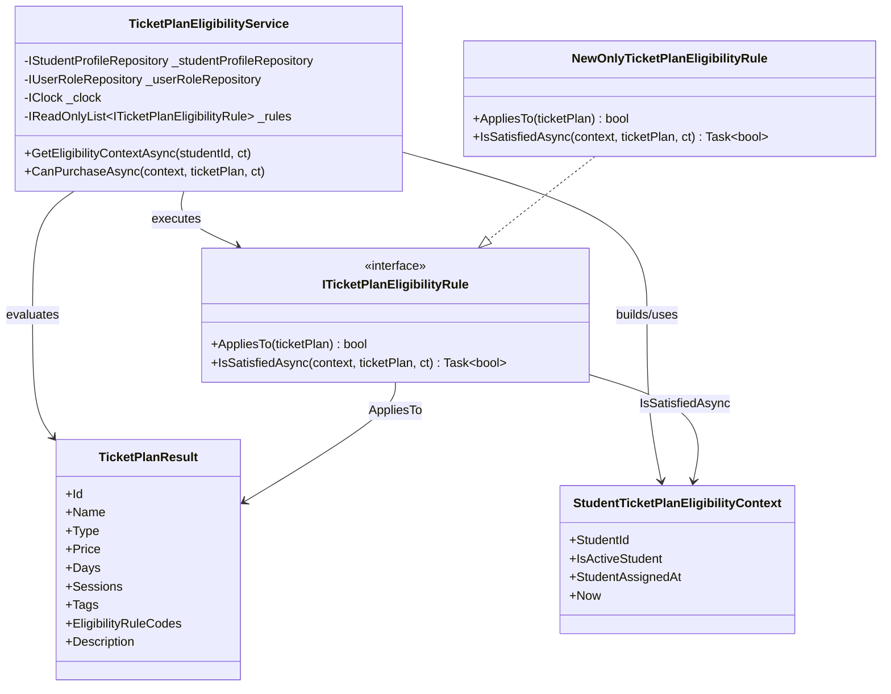

# ITicketPlanEligibilityRule 說明

這份筆記整理 `ITicketPlanEligibilityRule` 的兩個方法用途、整體設計原因，以及對應流程圖。

## 介面方法用途

檔案位置：
`src/gym-system.Application/TicketPlansUseCase/Queries/ITicketPlanEligibilityRule.cs`

### `AppliesTo(TicketPlanResult ticketPlan)`

用途：
判斷這條規則是否要套用到指定票券方案。

設計意圖：
- 先根據票券本身的設定決定是否需要檢查這條規則
- 避免每一條規則都對所有票券做完整驗證
- 讓規則與票券之間透過 `EligibilityRuleCodes` 做鬆耦合對應

以 `NewOnlyTicketPlanEligibilityRule` 為例：
- 如果 `ticketPlan.EligibilityRuleCodes` 包含 `NEW_ONLY`
- 則這條規則適用於該票券，回傳 `true`

### `IsSatisfiedAsync(StudentTicketPlanEligibilityContext context, TicketPlanResult ticketPlan, CancellationToken ct)`

用途：
在規則確定適用的前提下，判斷目前這位學生是否真的符合購買資格。

設計意圖：
- 專注處理資格判斷邏輯
- 可以使用 `context` 內的學生資料、目前時間等資訊
- 保留非同步能力，未來若需查資料庫或外部服務，不用修改介面

以 `NewOnlyTicketPlanEligibilityRule` 為例：
- 先檢查 `StudentAssignedAt` 是否有值
- 再判斷學生加入時間是否在最近 30 天內
- 符合才回傳 `true`

## 為什麼這樣設計

### 1. 分離「是否適用」與「是否通過」

這是最核心的切分：
- `AppliesTo` 負責判斷規則要不要管這張票
- `IsSatisfiedAsync` 負責判斷這個人有沒有通過這條規則

這樣可以讓每條規則保持單一職責，也讓主流程更清楚。

### 2. 方便擴充新規則

如果未來新增：
- `VIP_ONLY`
- `FIRST_PURCHASE_ONLY`
- `STAFF_ONLY`

只需要新增新的 `ITicketPlanEligibilityRule` 實作，並註冊到 DI，即可被 `TicketPlanEligibilityService` 自動納入流程。

### 3. 主流程穩定

`TicketPlanEligibilityService` 不需要知道每條規則的細節，只要：
- 逐條檢查是否適用
- 適用時執行資格驗證
- 任一條失敗就不可購買

這讓主流程固定，規則可以獨立演進。

### 4. 避免污染 Domain

`TicketPlanResult` 是查詢結果模型，裡面有註解寫了：
`為了不汙染 Domain`

代表這邊的資格規則資訊是偏應用層 / 查詢層的需求，不直接塞進 Domain Entity，讓 Domain 保持純粹。

## 角色分工

- `TicketPlanEligibilityService`
  負責收集學生資格資料，並執行所有規則
- `ITicketPlanEligibilityRule`
  定義單條規則的標準介面
- `NewOnlyTicketPlanEligibilityRule`
  實作其中一條具體規則
- `TicketPlanResult`
  提供票券方案資料，以及該票券有哪些資格規則代碼
- `StudentTicketPlanEligibilityContext`
  提供目前學生的資格判斷所需資料

## 流程圖

```mermaid
flowchart TD
    A[GetEligibilityContextAsync(studentId)] --> B[Trim and validate studentId]
    B --> C[Find student profile]
    C -->|profile not found| X[Return null]
    C -->|profile found| D[Get active Student role]
    D -->|role missing or inactive| X
    D -->|role active| E[Build StudentTicketPlanEligibilityContext]
    E --> F[CanPurchaseAsync(context, ticketPlan)]

    F --> G{context.IsActiveStudent?}
    G -->|No| Y[Return false]
    G -->|Yes| H[Loop rules]

    H --> I[rule.AppliesTo(ticketPlan)]
    I -->|No| H
    I -->|Yes| J[rule.IsSatisfiedAsync(context, ticketPlan, ct)]
    J -->|false| Y
    J -->|true| K{More rules?}
    K -->|Yes| H
    K -->|No| Z[Return true]
```

## 類別關係圖


